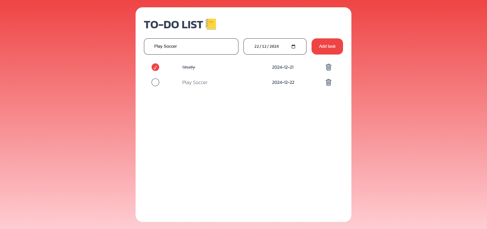

# Aplicação de Lista de Tarefas

Uma simples aplicação de Lista de Tarefas construída com HTML, CSS e JavaScript. Este projeto ajuda a gerenciar tarefas de forma eficiente, permitindo adicionar, marcar como concluídas e excluir tarefas.

---

## Funcionalidades

- Adicionar novas tarefas com descrição e data de vencimento.
- Marcar tarefas como concluídas.
- Excluir tarefas da lista.
- Atualizações dinâmicas sem necessidade de recarregar a página.

---

## Design

---

